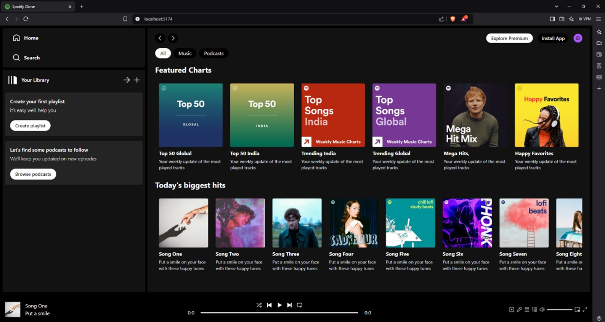
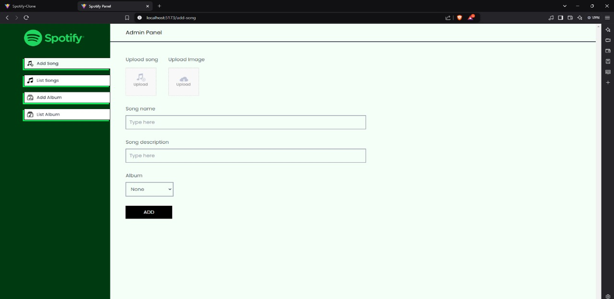
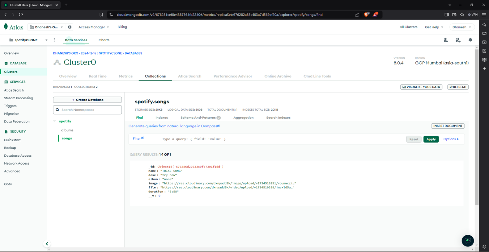

# Full Stack Spotify Clone
==========================

USER-INTERFACE DEMO:

ADMIN-INTERFACE DEMO:

MongoDB INTERFACE :

## Features

- **Song Upload**: Upload and manage your music files with ease.

- **Stripe Integration**: Enable premium subscriptions within the application using Stripe for payment processing.

- **Database Handling**: Learn to set up a Supabase project, create database schemas, and manage data with PostgreSQL.

- **Sleek User Interface**: Using Tailwind CSS, create a UI that closely resembles Spotify's sleek design.

- **Responsiveness**: This application is fully responsive and compatible with all devices.

- **Authentication**: Secure user registration and login processes with Supabase.

- **GitHub Authentication Integration**: Enable secure login using Github authentication.

- **File/Image Upload**: Upload files and images using Supabase storage.

- **Form Validation**: Efficient client form validation and handling using react-hook-form.

- **Error Handling**: Smooth server error handling with react-toast.

- **Audio Playback**: Enable song playback within the application.

- **Favorites System**: Users can mark songs as favorites.

- **Playlists / Liked Songs System**: Create and manage song playlists.

- **Advanced Player Component**: Explore the functionality of an advanced music player component.

## Built With

- Node.js
- React.js
- Tailwind CSS
- HTML
- MongoDB(NoSQL)
- react-hook-form
- MERN STACK

## License

This project is licensed under the terms of the MIT license.

## Contributions

Contributions, issues, and feature requests are welcome!

## Get in Touch

<b>Email: </b> dhaneshlakhwani24@gmail.com  
<b>LinkedIn: </b> [https://www.linkedin.com/in/dhaneshlakhwani24/] (https://www.linkedin.com/in/dhaneshlakhwani24/)   
